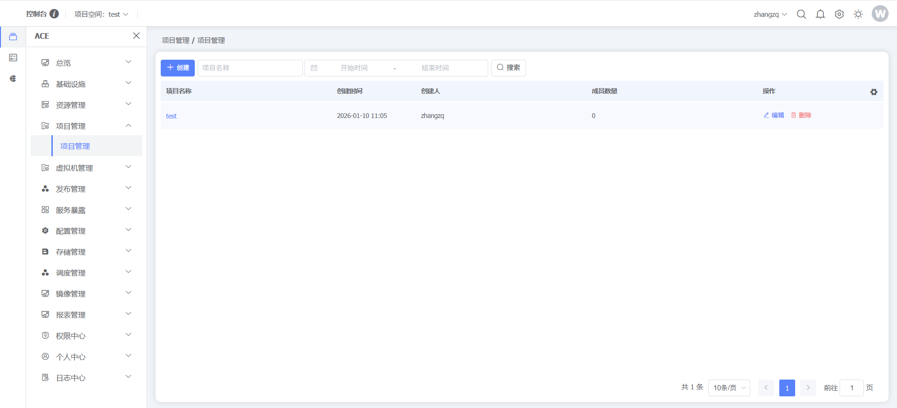
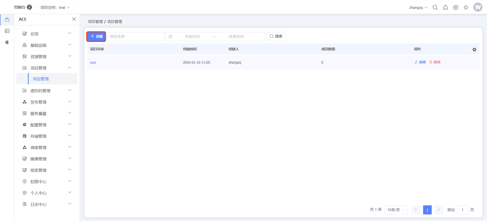
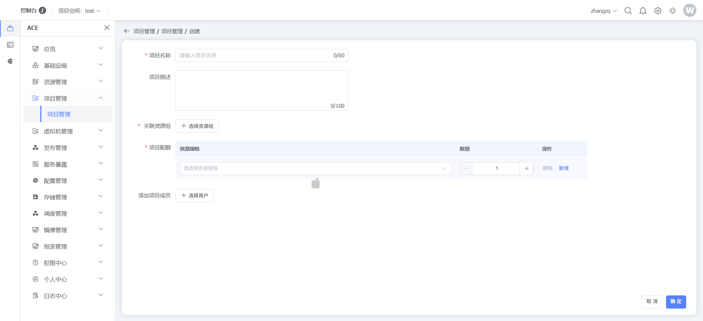
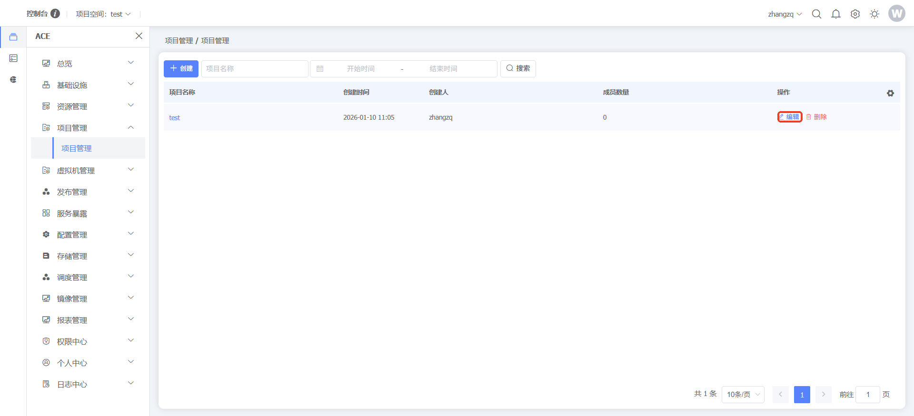
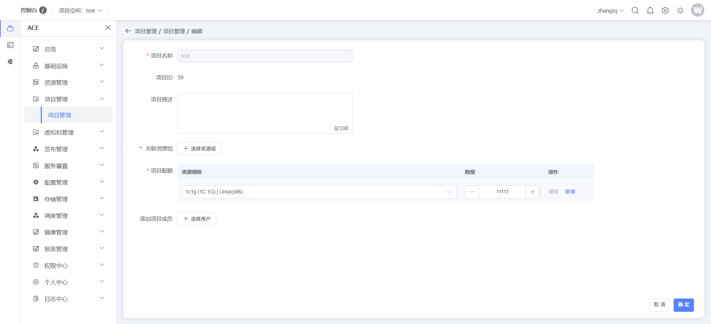
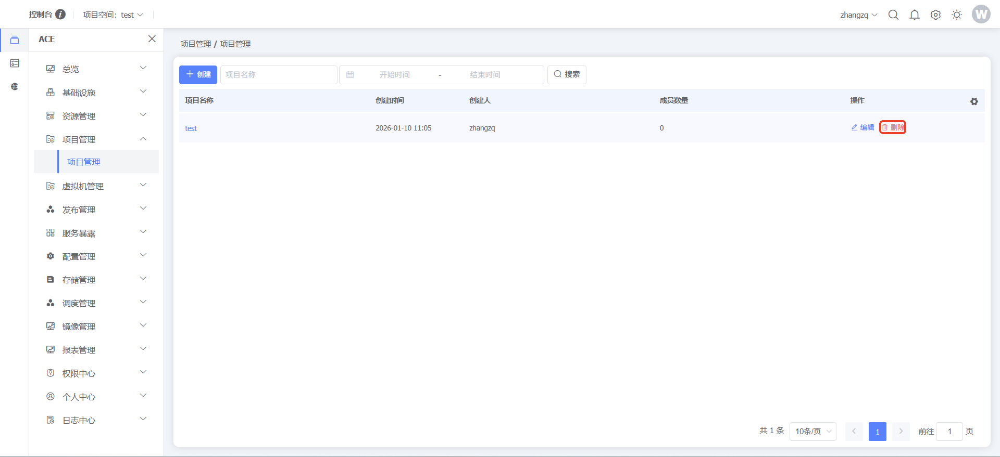
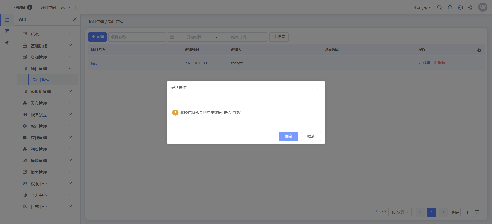

### 项目管理

#### 项目管理

**功能说明：**项目管理是用户在使用平台过程中，通过项目来管理不同的项目团队、资源、镜像的功能，来实现团队高效协作、提升AI训推效率和提升资源利用效率的功能。
**操作说明：**点击左侧菜单【ACE】，点击【项目管理】，点击【项目管理】，可查看/管理项目，仅租户管理员可以创建项目

点击【创建】按钮，创建项目

点击数据行末【编辑】按钮，可以对项目进行编辑

点击数据行末【删除】按钮，删除项目，删除项目之前需要解绑项目资源才可以删除

