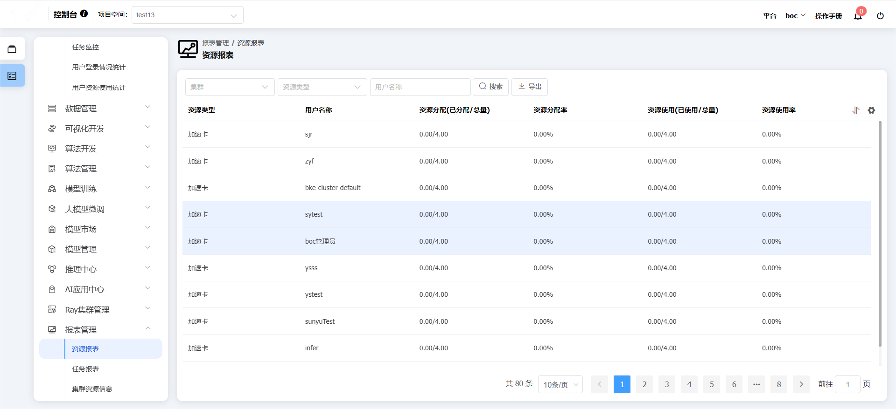
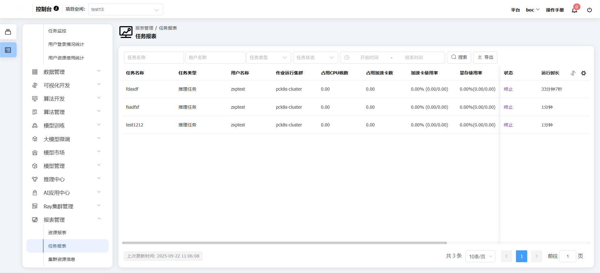
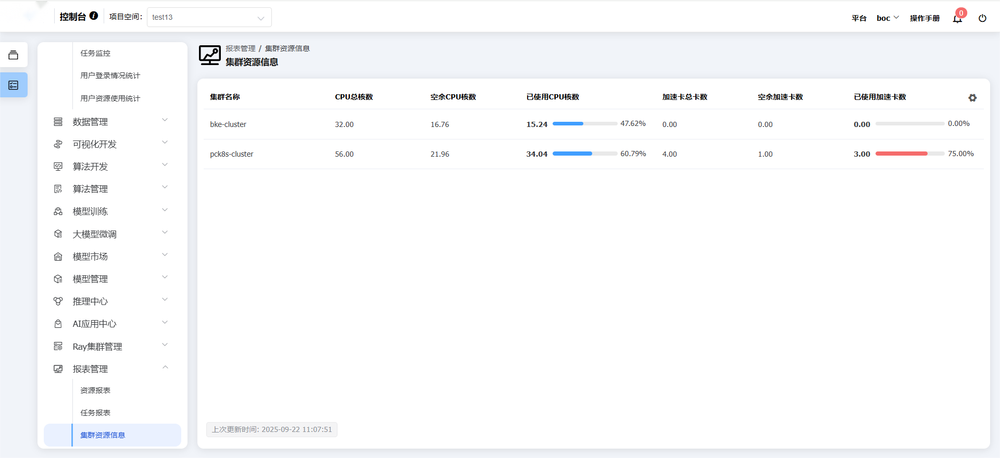
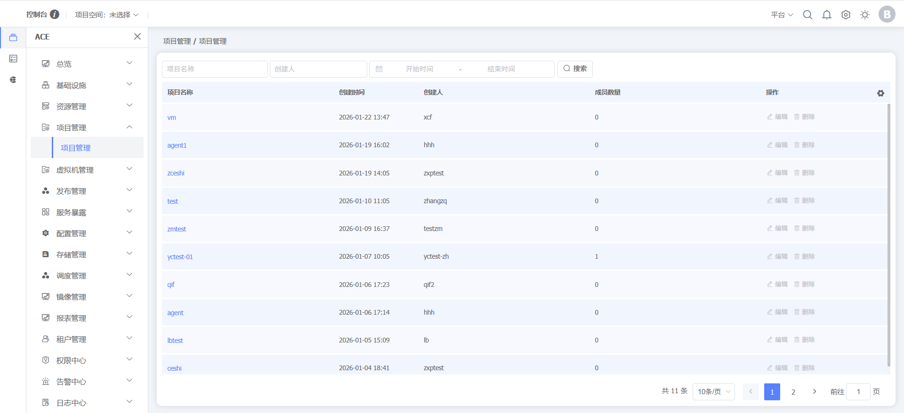

### 报表管理

#### 资源报表

**功能说明：**以报表的形式展示平台中不同资源、不同用户的分配、使用情况，帮助用户统计当前平台资源分布。
**操作说明：**点击左侧菜单【BMP】，点击【报表管理】，点击【资源报表】，可查看/管理资源报表

#### 任务报表

**功能说明：**以报表的形式展示平台中所有运行中的任务，可以查看不同类型、不同状态的任务，帮助用户更好的统计平台任务。
**操作说明：**点击左侧菜单【BMP】，点击【报表管理】，点击【任务报表】，可查看/管理任务报表

#### 集群资源信息

**功能说明：**以报表的形式展示平台的集群以及集群资源信息。
**操作说明：**点击左侧菜单【BMP】，点击【报表管理】，点击【集群资源信息】，可查看/管理集群资源信息

### 项目管理

**功能说明：**项目管理是用户在使用平台过程中，通过项目来管理不同的项目团队、资源、镜像的功能，来实现团队高效协作、提升AI训推效率和提升资源利用效率的功能。
**操作说明：**点击左侧【ACE】，点击【项目管理】，点击【项目管理】，可查看/管理项目

