### 资源管理

#### 资源规格管理

**功能说明：**资源规格管理是根据业务需求、系统性能要求以及硬件特性（如加速卡），为不同任务或应用动态分配计算资源的过程。其核心目标是实现资源的高效利用，在满足业务性能需求的同时优化系统成本。
**操作说明：**点击左侧菜单【ACE】，点击【资源管理】，点击【资源规格管理】，可查看/管理平台资源规格
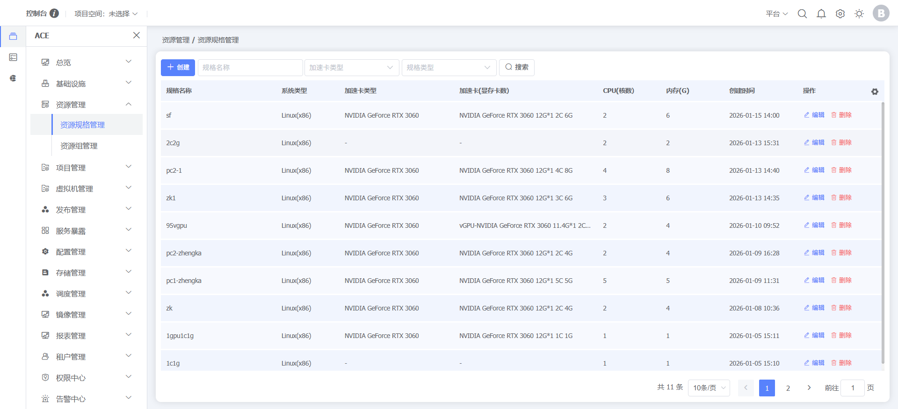
点击【创建】按钮，创建资源规格，支持创建CPU规格和加速卡规格，选择加速卡规格时支持整卡或虚拟卡规格
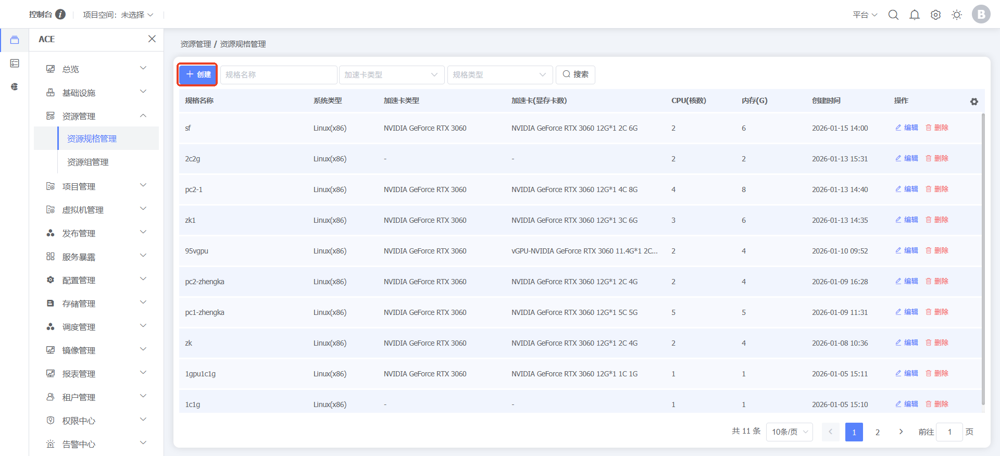
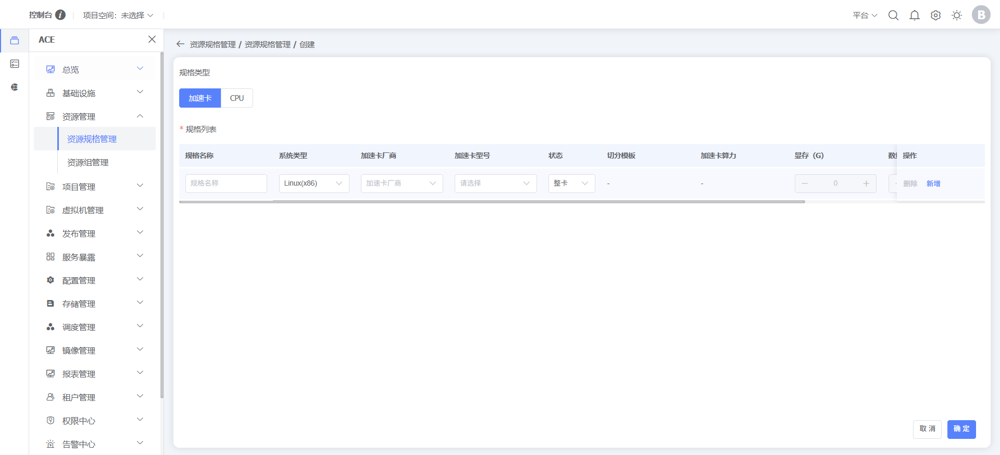
点击行末【编辑】按钮，编辑资源规格
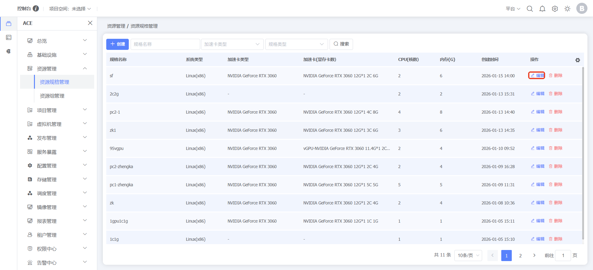
点击行末【删除】按钮，删除资源规格
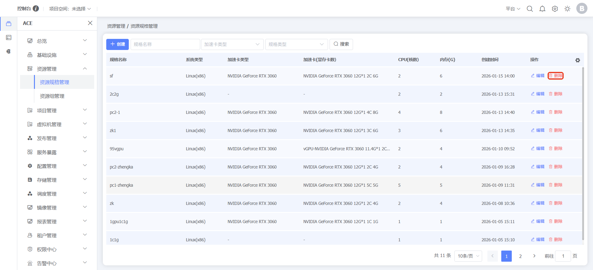
创建资源规格以后，在发布任务资源配置时直接选择对应资源规格发布任务
#### 资源组管理

**功能说明：**资源组管理是针对加速卡资源的一种资源管理和调度机制。在多租户或多用户环境中，加速卡资源往往是昂贵且有限的，因此需要通过配额管理来确保各个用户或任务能够公平、高效地使用GPU资源。
**操作说明：**点击左侧菜单【ACE】，点击【资源管理】，点击【资源组管理】，可查看/管理平台资源组
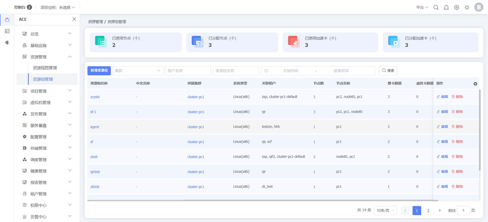
点击【新建资源组】按钮，创建资源组，支持创建整卡资源组和虚拟卡资源组
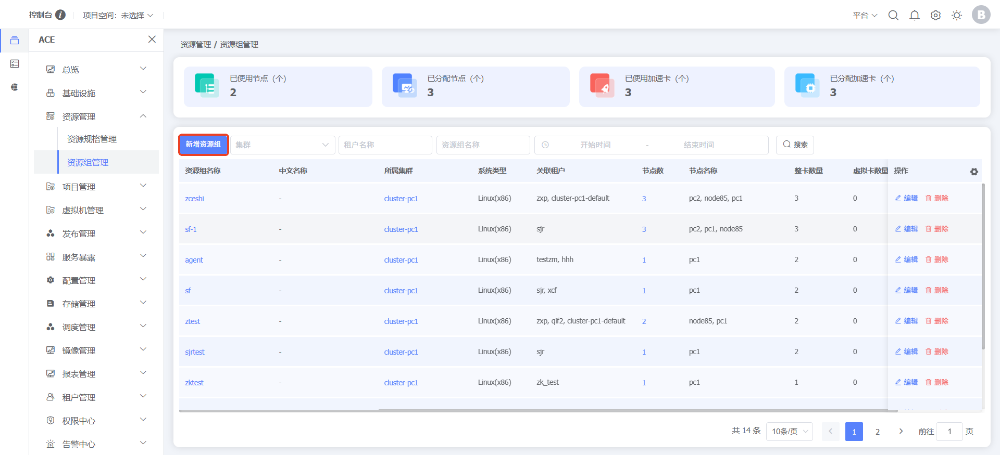
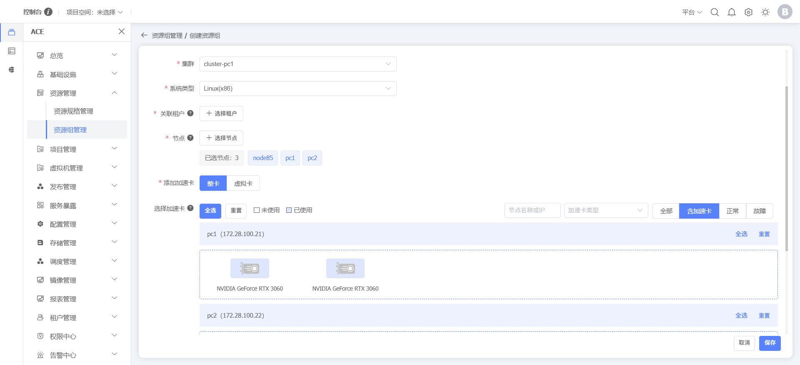
点击行末【编辑】按钮，编辑资源组
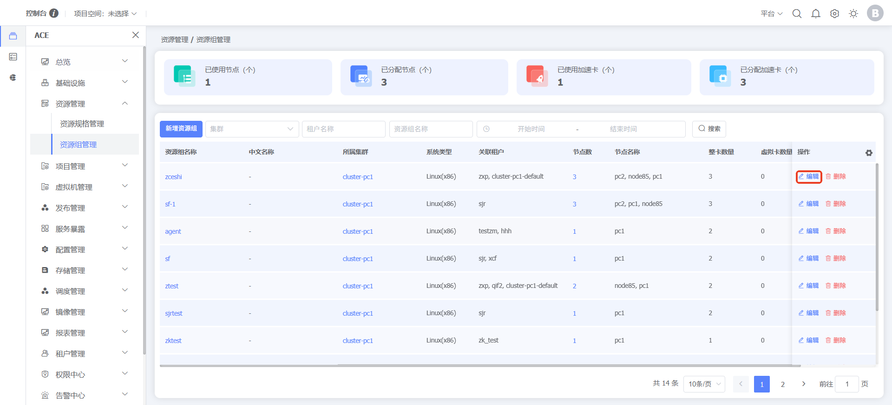
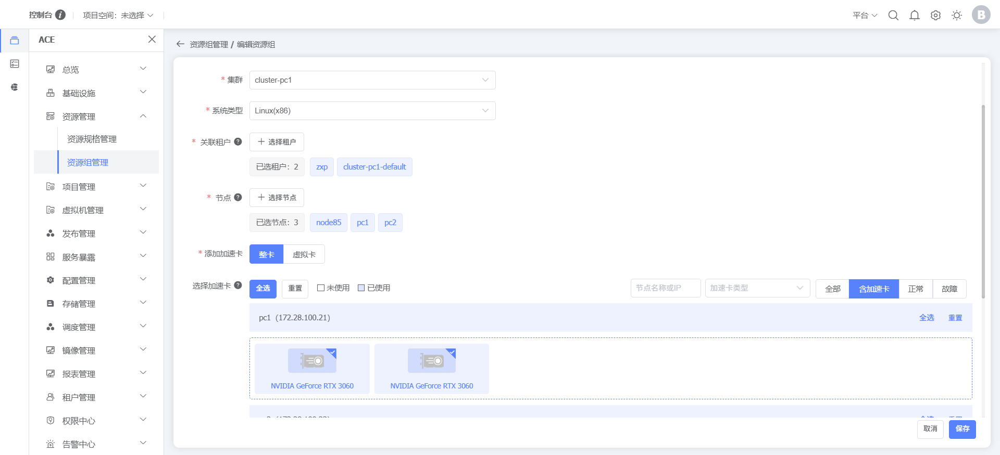
点击行末【删除】按钮，删除资源组
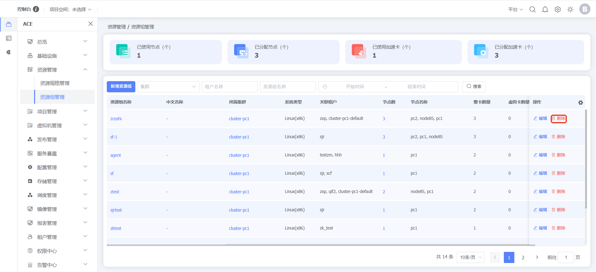
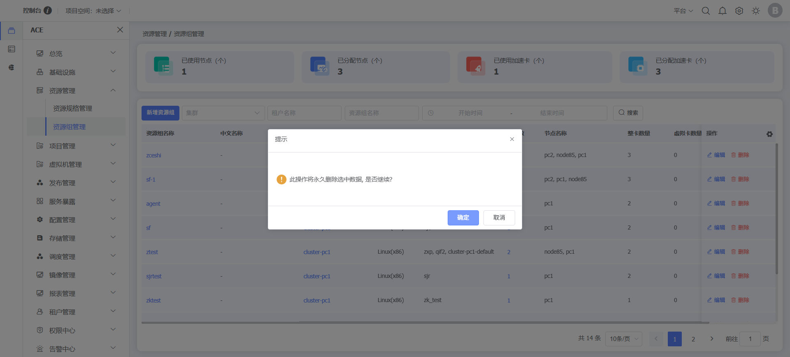

