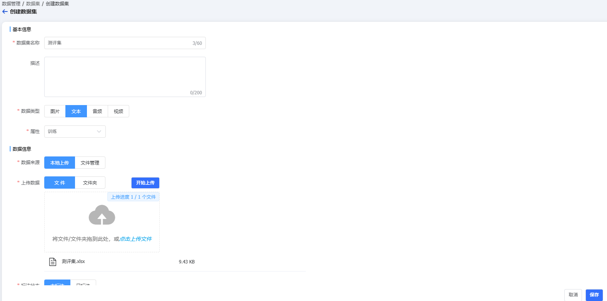
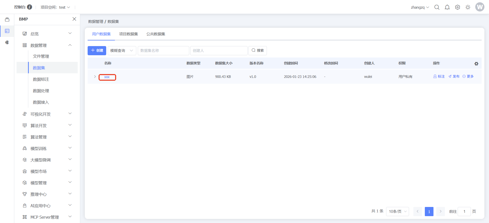
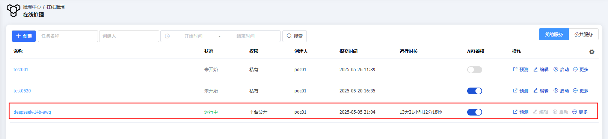
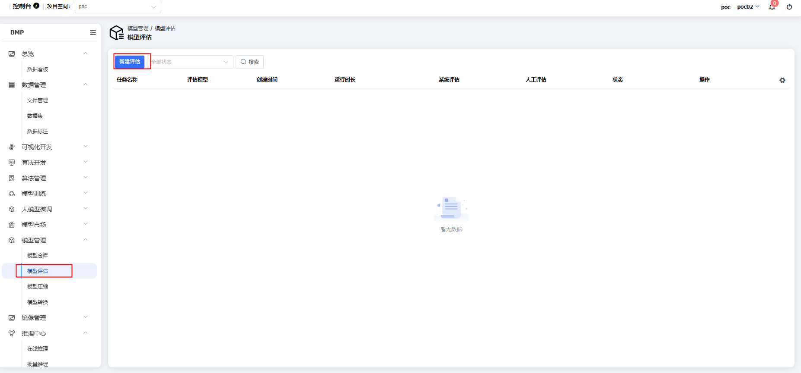
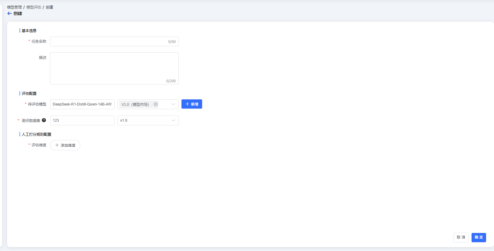
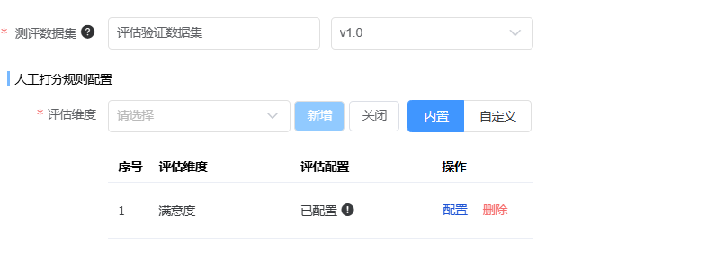

### 大模型评估场景示例说明

### 登录

输入管理员账号密码，登录系统

### 测评集准备

点击左侧菜单【BMP】，点击【数据管理】-【数据集】，在左上角选择项目空间，创建测评集

### 大模型准备

点击左侧菜单【BMP】，点击【推理中心】-【在线推理】，选择大模型（参考deepseek-r1-14b），创建推理任务

### 创建模型评估

点击左侧菜单【BMP】，点击【模型管理】-【模型评估】，创建评估任务

配置参考：
待评估模型：建议deepseek-r1-14b
测评数据集：建议使用公版测评集
人工打分配置：参考：满意度、准确度等
配置完成后，点击【确认】按钮，完成大模型评估任务配置，点击人工评估开始进行评估，评估完成后可以查看结果

