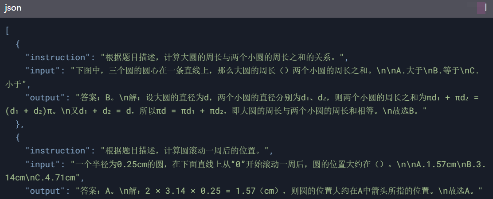
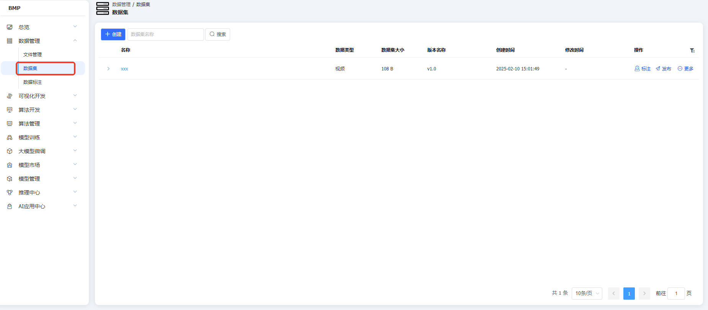
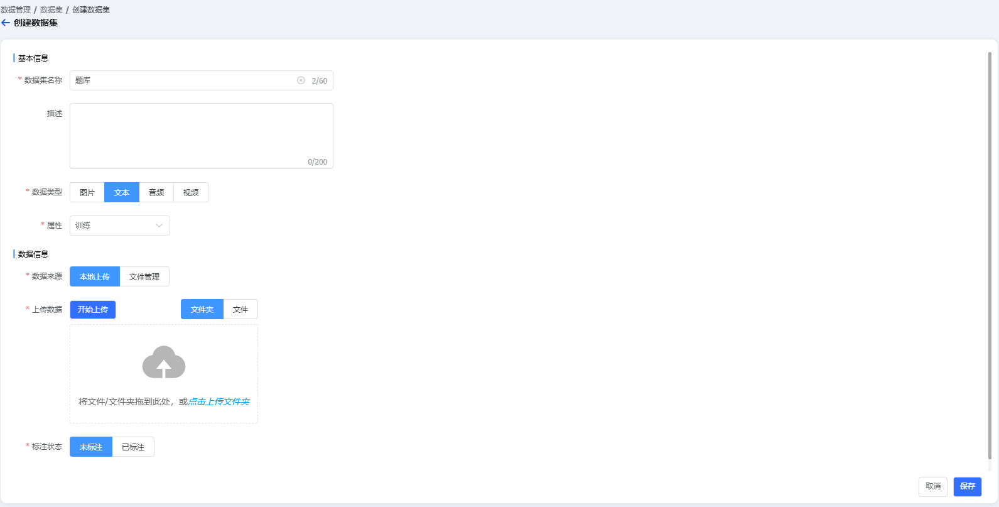
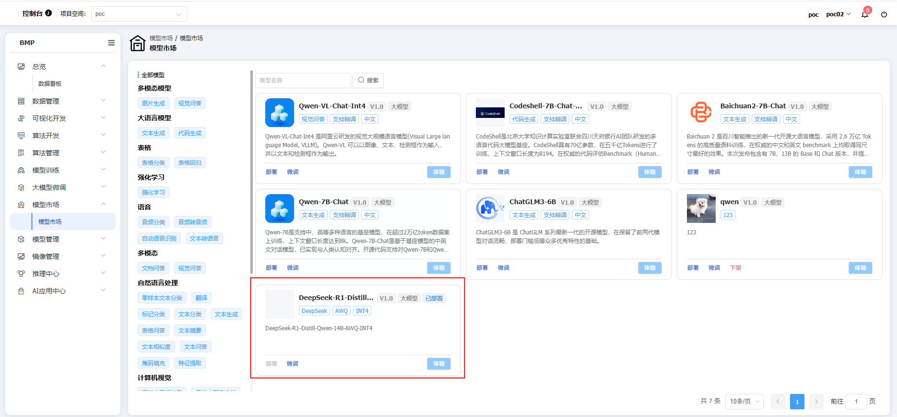
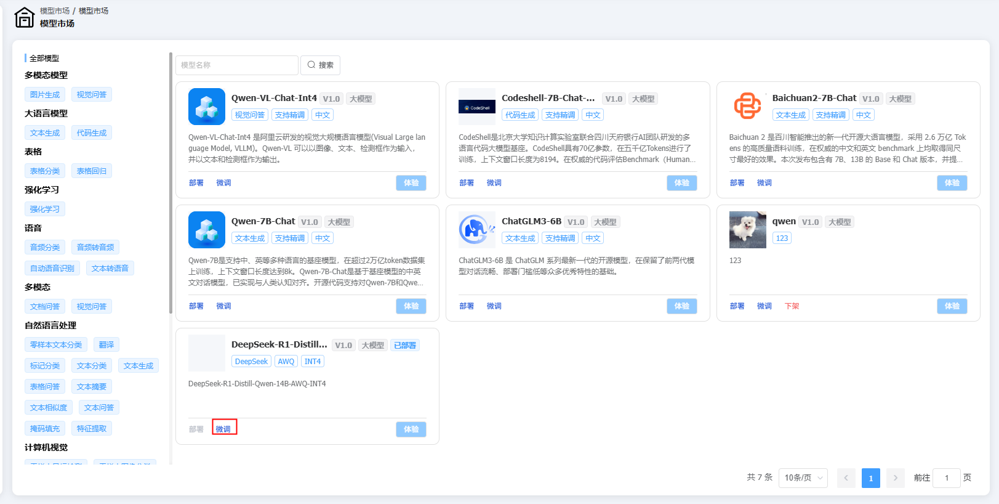
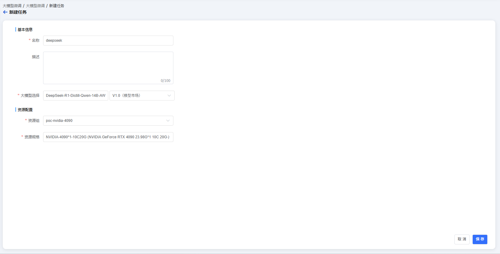
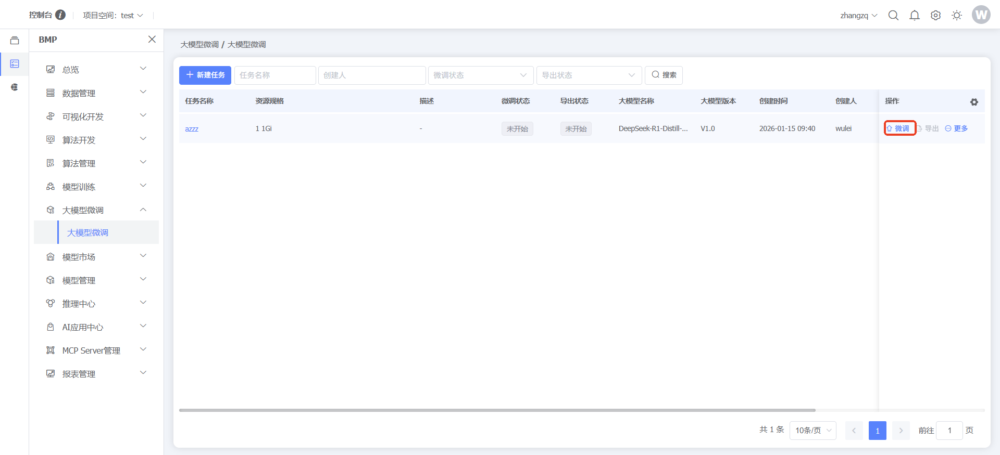
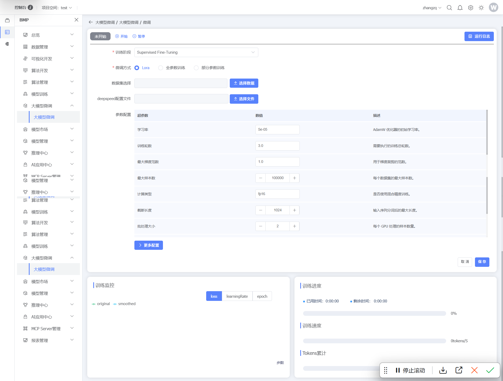

### 大模型微调业务场景示例说明

### 登录

输入管理员账号密码，登录系统

### 数据集准备

数据集要求：
对于平台而言，微调所用的数据集需要满足一下如下格式：
{
"instruction": "使用XXX框架实现XX功能，要求为XX",
"input": "", 
"output": "对应代码"
}
这样模型在微调的过程中就可以进行识别，博云会提供对应数据转换服务，把客户提供的数据集转为以上要求的JSON文件。
例如：我们根据在线教育客户提供的一个题库，将题库转为以上格式的JSON文件：

数据集制作好以后，点击左侧菜单【BMP】，点击【数据管理】，点击数据集-用户数据集，在左上角选择项目空间，创建数据集

### 模型准备

#### 模型市场

点击左侧菜单【BMP】，点击【模型市场】，选择大模型，开始进行微调

默认选择deepseek-r1-14B，点击微调，进行微调

### 大模型微调

#### 微调任务

微调任务创建以后，点击数据行末【微调】按钮，进入微调面板

根据微调需求选择对应的阶段，微调方式有LoRA、全参数微调和部分参数微调三种，根据需求进行选择，数据集选择根据以上要求做好相应的数据集即可。
大模型微调结束以后，支持导出到模型仓库，再进行一键推理
参数配置：
1、LoRA微调：
核心参数
秩（lora_rank）：建议 8-64，简单任务选择小秩（如8），复杂任务需≥16以保留表达能力12。
Alpha（lora_alpha）：通常设为秩的整数倍（如秩8时alpha=16），控制权重更新强度，值越大对新任务适应能力越强1。
Dropout（lora_dropout）：小数据场景设为 0.3 防过拟合，大数据场景可设为 01。
通用参数
学习率：建议 1e-5 到 5e-4，比全参数微调更低，避免破坏预训练知识2。
批处理大小：显存不足时可用梯度累积（如batch_size=2 + 梯度累积步数8），等效batch_size=161。
适用场景：资源有限、需快速迭代的任务（如对话生成），支持多任务共享基础模块。
2、全参数微调：
关键参数
学习率：推荐 1e-6 到 5e-5（比LoRA更低），大型模型（如百亿参数）优先小学习率。
训练轮次：大数据集（百万级样本）建议 5-10 轮，小数据集需早停防止过拟合。
显存需求：至少需A100（80GB）级别GPU，支持大batch_size（如32）。
优化策略
混合精度训练：启用 bf16 或 fp16 加速训练，同时降低显存占用。
适用场景：数据充足、任务复杂（如领域迁移），需全面调整模型参数。
3、部分参数微调：
核心参数
冻结层数：通常冻结底层（如前20层），仅微调顶层全连接层，保留通用语义特征。
学习率：可略高于全参数微调（如 5e-5），因高层参数需快速适应任务。
训练轮次：推荐 3-5 轮，小数据集也能快速收敛。

