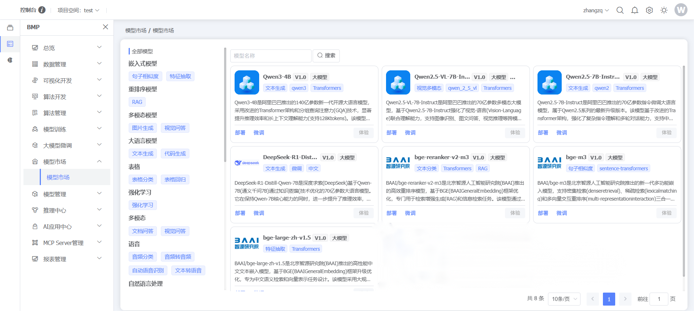
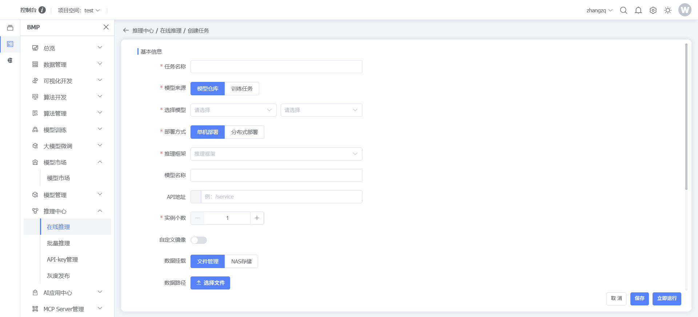
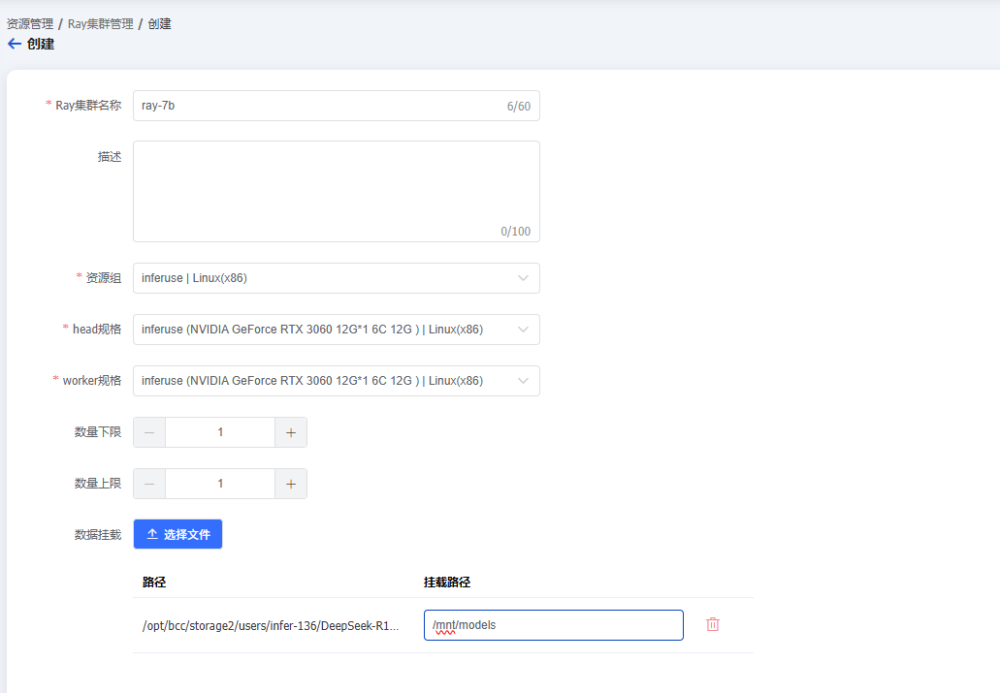
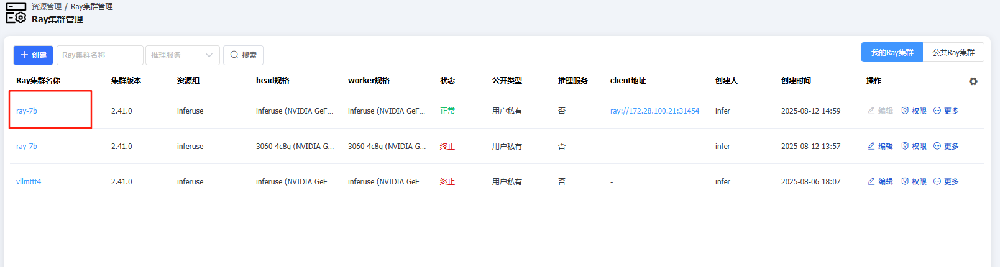
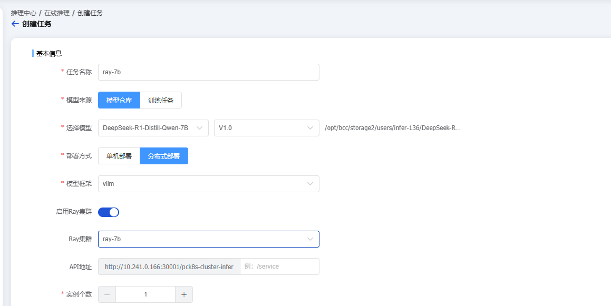
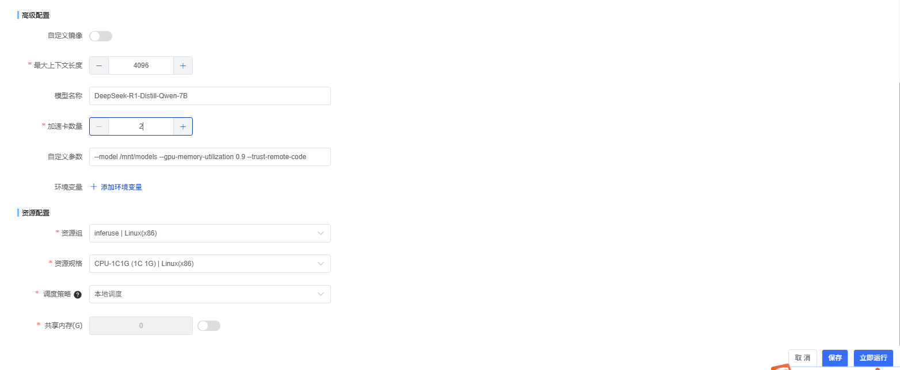
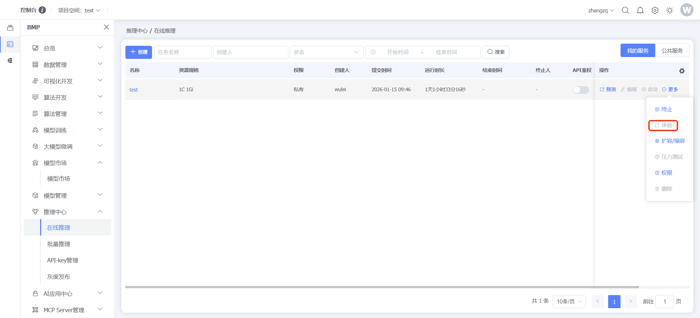
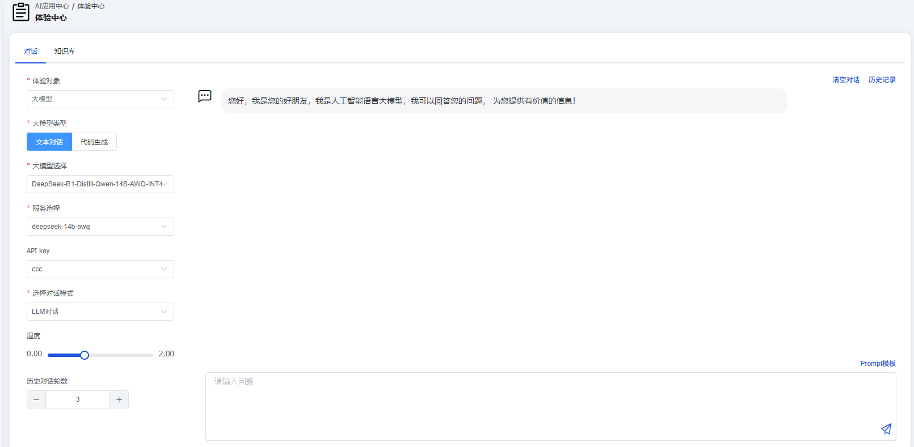

### 大模型推理业务场景示例说明

### 登录

输入管理员账号密码，登录系统

### 2.模型市场

点击左侧菜单【BMP】，点击【模型市场】，选择大模型，开始进行部署

### 3.大模型推理（单机部署）

点击模型市场里大模型卡片内的【部署】按钮，创建推理任务

大模型推理配置：
模型框架：vllm
服务路径：用户自定义
资源配置：建议3090以上整卡
### 大模型推理（分布式部署）

点击左侧菜单【ACE】，点击【基础设施】，选择Ray集群管理，开始创建Ray集群
点击【创建】按钮，创建Ray集群（备注：分布式推理暂不支持自定义镜像）

参考配置：
Head规格：Nvidia 3060 12G*1 6C 12G（推荐）
Worker规格：Nvidia 3060 12G*1 6C 12G（推荐）
数据挂载
路径：自定义
挂载路径：/mnt/models
点击左侧菜单【BMP】，点击【推理中心】，选择在线推理，开始创建推理任务

参考配置：
部署方式：分布式部署
模型框架：vllm
启用Ray集群：开启
Ray集群名称：选择自己创建的Ray集群
最大上下文长度：4096(推荐）
加速卡数量：分布式推理卡数需要大于2的整数
### 4.大模型体验

点击左侧菜单【BMP】，点击【推理中心】-【在线推理】，在左上角选择项目空空间，选择已经创建好的大模型推理服务，点击行末的【体验】按钮，进行大模型对话

